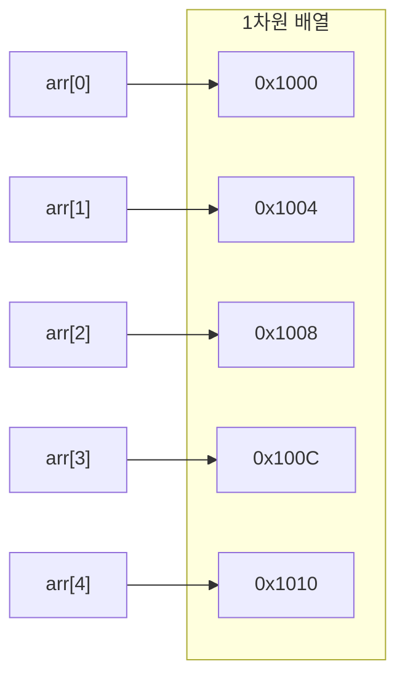
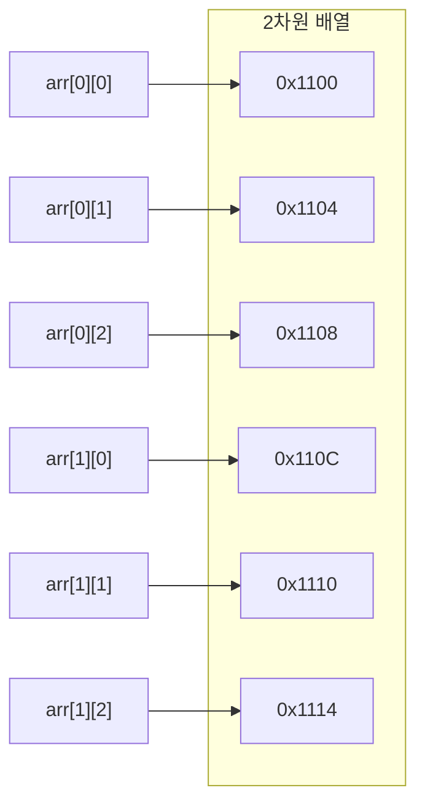

# 관련 문제
- [두 개 뽑아서 더하기](https://github.com/han-chunsik/Algorithm/tree/41d83cbabc62d76e5bc107db77c1c1c124b21944/%ED%94%84%EB%A1%9C%EA%B7%B8%EB%9E%98%EB%A8%B8%EC%8A%A4/1/68644.%E2%80%85%EB%91%90%E2%80%85%EA%B0%9C%E2%80%85%EB%BD%91%EC%95%84%EC%84%9C%E2%80%85%EB%8D%94%ED%95%98%EA%B8%B0)

# 배열
배열은 인덱스와 값을 1:1 대응해 관리하는 자료구조로 어떤 위치에 있는 데이터든 한 번에 접근 가능


```java
int[] arr = {0,0,0,0,0};
int[] arr = new int[5]; // {0,0,0,0,0}
```

- 배열은 인덱스가 0부터 시작
- 배열은 선언할 때 크기가 고정되며, 한 번 설정한 크기를 실행 중에 변경할 수 없음

</br>
</br>

## 다차원 배열
메모리의 구조는 1차원이므로 배열은 차원과 무관하게 메모리에 연속 할당 됨(배열의 각 데이터는 메모리의 낮은 주소 -> 높은 주소 방향으로 연이어 할당)

| 참고) 배열이 int형(4바이트)이라 4바이트 간격으로 메모리 주소 표시함

### 1차원 배열
```java
int[] arr = {0,0,0,0,0};
```



### 2차원 배열
2차원 배열은 1차원 배열 객체 여러 개를 묶어 놓은 것 이므로, 각 1차원 배열 객체가 메모리에서 따로 저장될 수도 있어서 항상 연속된 공간에 저장된다고 보장할 수 없음  
즉, 각 배열 안의 값들은 연속된 메모리에 저장되고, 각 1차원 배열 끼리는 떨어져 있을 가능성이 있음

```java
int[][] arr = {{0,0,0},{0,0,0}};
```



</br>
</br>

## ArrayList
Java에서 크기가 동적으로 변경되는 배열이 필요할 경우 활용

### 데이터 삽입
- 맨 끝에 데이터 추가
```java
ArrayList<Integer> list = new ArrayList<>();

list.add(0); // [0]
list.add(0); // [0, 0]
list.add(0); // [0, 0, 0]

// 같은 값을 가지 리스트 생성
ArrayList<Integer> list2 = new ArrayList<>(list);
System.out.println(list2); // [0, 0, 0]
```

### 데이터 접근
```java
ArrayList<Integer> list = new ArrayList<>();

list.add(1); // [1]
list.add(2); // [1, 2]
list.add(3); // [1, 2, 3]

System.out.println(list.get(2)); // 3
```

### 데이터 삭제
```java
ArrayList<Integer> list = new ArrayList<>();

list.add(1); // [1]
list.add(2); // [1, 2]
list.add(3); // [1, 2, 3]

list.remove(2);

System.out.println(list); // [1, 2]
```

</br>
</br>

## 배열, ArrayList 관련 메서드
### 전체 데이터 개수
```java
int[] arr = {1,2,3,4,5};
System.out.println(arr.length); // 5

ArrayList<Integer> list = new ArrayList<>(Arrays.asList(1,2,3,4,5));
System.out.println(list.size()); // 5
```
### 데이터 정렬
```java
int[] arr = {2,3,1,4,5};
Arrays.sort(arr); // [1,2,3,4,5]

ArrayList<Integer> list = new ArrayList<>(Arrays.asList(2,3,1,4,5));
Collections.sort(list) // [1,2,3,4,5]
```
### ArrayList 저장된 데이터 여부 확인
```java
ArrayList<Integer> list = new ArrayList<>(Arrays.asList(1,2,3,4,5));
System.out.println(list.isEmpty()); // false
```

</br>
</br>

## 효율성
배열 연산의 시간 복잡도를 통한 효율성 확인

### 데이터 접근
배열은 임의 접근 방법을 통해 데이터에 접근하기 때문에, 따라서 시간복잡도는 $O(1)$

> 임의 접근: 기억 장치에서 데이터를 읽거나 쓸 때 위치에 상관없이 같은 시간이 걸리는 방식, 순서대로 찾지않고, 원하는 위치를 바로 찾아 빠르게 접근

### 데이터 삽입
### _맨 뒤_
- 배열에 여유 공간이 있는 경우: $O(1)$
- 배열이 꽉 차서 새로운 배열을 생성해야 하는 경우: $O(N)$ (기존 데이터를 새 배열로 복사해야 하므로)


### _맨 앞_
- 기존 데이터를 뒤로 한칸 씩 멀어야하므로 $O(N)$

### _중간_
- 현재 삽입한 데이터 뒤에 있는 데이터 개수만큼 한칸 씩 밀어야하므로 $O(N)$

</br>
</br>

## 배열 선택
데이터에 자주 접근해야 하는 경우 배열을 사용하면 효율적이지만, 메모리 공간을 충분히 확보해야하는 단점이 있음, 따라서 다음 고려사항에 따라 배열을 선택해야 함

1. 할당할 수 있는 메모리 크기 확인
- 운영체제마다 배열을 할당 할 수 있는 메모리의 한계는 다르지만 코딩테스트에서는 보통 정수형 1차원은 1000만개, 2차원은 3000*3000 크기를 최대로 생각함
2. 중간에 데이터 삽입이 많은지 확인
- 데이터를 빈번하게 삽입하면 그에따라 시간 복잡도가 높아짐
