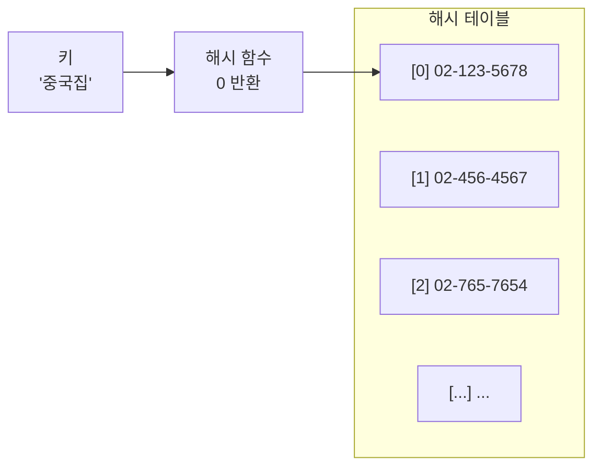
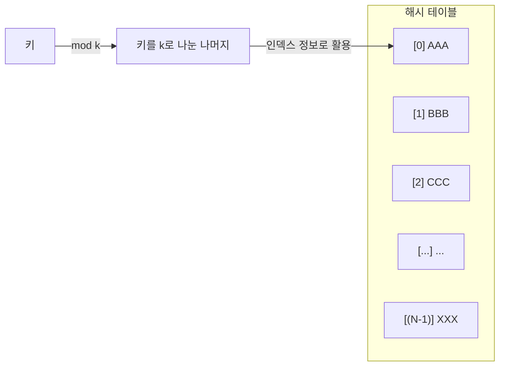
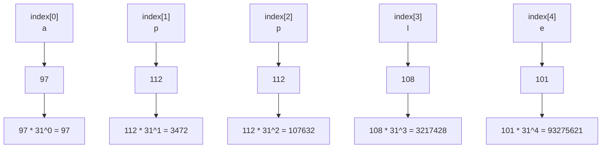
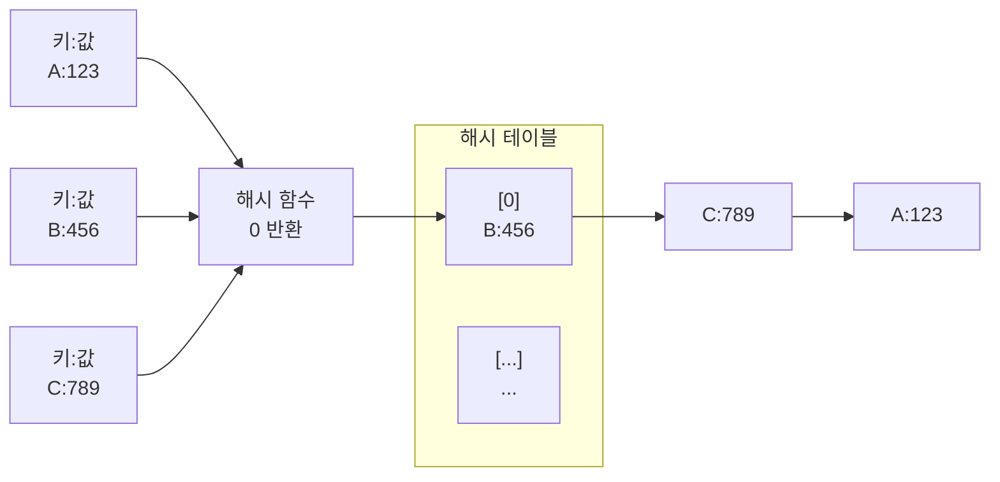

# 관련 문제

# 해시  
해시 함수를 사용해서 변환한 값을 인덱스로 삼아 키(key)와 값(value)을 저장해서 빠른 데이터 탐색을 제공하는 자료구조로 키를 활용해 데이터 탐색을 빠르게 함  

> 실제 코딩 테스트 문제에서 해시 문제의 핵심은 키와 값을 매핑하는 과정으로, 특정 값이나 정보를 기준으로 빈번한 검색을 해야하는 경우, 특정 정보와 매핑하는 값의 관계를 확인해야하는 작업이 문제에 있으면 해시 활용  

## 특징
1. 단방향 동작: 해시는 키를 통해 값을 찾을 수 있지만, 값을 통해 키를 찾을 수 없음
2. 키 자체가 해시 함수에 의해 값이 인덱스가 되므로 값을 찾기 위한 탐색 과정이 필요없어, 찾고자 하는 값을 $O(1)$ 시간복잡도로 바로 찾을 수 있음
3. 값을 인덱스로 활용하려면 적절한 변환 과정을 거쳐야 함

> 단 방향으로만 검색할 수 있는 대신 빠르게 조회가 가능해 비밀번호 관리, 데이터베이스 인덱싱, 블록체인 등에 활용됨


## 흐름



1. 키('중국집') 입력
2. 해시 함수를 통한 변환(해시값 0 생성)
3. 해시 테이블에서 해당 인덱스(버킷[0])에 저장된 값 조회
4. 값(전화번호) 반환

## 해시함수 구현
> 코딩 테스트에서 해시 함수를 직접 구현하라는 문제가 나오는 경우는 거의 없음, 자바에서는 HashSet, HashMap 클래스를 사용하면 해시를 쉽게 사용할 수 있음

### 고려사항
1. 해시 함수가 변환한 값은 인덱스로 활용되므로 해시 테이블의 큭를 넘으면 안됨 (0~N-1 사이의 값)
2. 해시 함수가 변환한 값의 충돌(두 키의 변환 값이 동일한 경우)은 최대한 적게 발생하야 함 (충돌이 아예 발생하지 않는 해시 함수는 거의 없음)

### 숫자 - 나눗셈법(division method)
키를 소수로 나눈 나머지를 활용(모듈러 연산)하는 방법($x$ 는 키, $k$는 소수)      

$$
h(x) = x\:mod\,k
$$  

```
h(key) = x % k
```



> 나눗셈 법에서 k를 소수로 사용하는 이유는 다른 수를 사용할 경우 출동 발생 가능성이 높기 때문, 따라서 상황에 따라 아주 많은 데이터를 저장할 경우 굉장히 큰 소수가 필요함, 매우 큰 소수를 구하기 쉽지 않다는 단점이 있음  

### 숫자 - 곱셈법  
황금비 활용($m$은 최대 버킷의 개수, $A$는 황금비)   

$$
h(x) = (((x * A)mod \,1)*m)
$$  

```
h(key) = (((x*A)%1)*m)
```

1. 키에 황금비(무한 소수로 대략 1.6180339887...)를 곱함 (x*A)  
2. 1에서 구한 값에 %1로 소수점 아래 부분만 추출
3. 2에서 구한 값에 테이블의 크기 m을 곱한 후 정수 추출하여 해시 테이블에 매핑

> 곱셈법은 황금비를 사용하므로 소수가 필요 없어 해시 테이블의 크기가 커져도 추가 작업이 필요 없음  

### 문자열 헤싱
문자열의 문자를 숫자로 변환하고 다항식의 값으로 변환하여 해싱 (s[i]는 문자열의 i번째 문자, p는  보통 해시의 기반이 되는 소수 사용(31, 53, 101 등), m은 해시 테이블의 최대 크기(큰 소수)

> 다음 함수는 가장 널리 사용되는 Polynomial Rolling Hash  
> p는 31이라고 가정

$$
hash(s) = (s[0] * p^0 + s[1] * p^1 + s[2] * p^2 + ... + s[n-1] * p^(n-1)) mod m
$$  

```
hash(s) = (s[0]*p^0 + s[1]*p^1 + s[2]*p^2 + s[3]*p^3 + s[4]*p^4) mod m
```



```
hash = (97 + 3,472 + 107,632 + 3,217,428 + 93,275,621) % 1_000_000_009
```

1. 문자열의 Unicode 값을 구한다. "apple"에서 a의 Unicode는 97
2. s[0] * p^0 는 97*1 이므로 97  
3. 2로 곱한 값들을 더한 최종값에 해시 테이블의 크기 m으로 모듈러 연산   


### 모듈러 연산 개선

$$
(a + b) mod\,c = ((a mod\, c + b mod\, c) mod\, c)
$$  

```
(a+b) % c = (a%c+b%c) % c 
```

키가 문자열일 경우 해시 함수를 적용한 값이 해시 테이블 크기에 비해 너무 클 수 있음, 따라서 해시 함수가 내는 결과의 크기를 해시 테이블 크기에 맞도록 하는 작업이 필요, 오버플로우가 발생할 가능성이 있으므로, 다음과 같이 문자열 해시 함수를 수정하여 방지할 수 있음   


- 문자열 해싱 공식 수정

    $$
    hash(s) = (s[0] * p^0 mod m +
            s[1] * p^1 mod m +
            s[2] * p^2 mod m +
            ...
            s[n-1] * p^(n-1) mod m) mod m
    $$  

    ```
    hash(s) = (s[0]*p^0%m + s[1]*p^1%m + s[2]*p^2%m + s[3]*p^3%m + s[4]*p^4%m) mod m
    ```


## 충돌(collision) 처리
다른 키에 대해서 해시 함수의 결괏값이 같으면 충돌, 해시 테이블 관리할 때에는 충돌 처리가 필요  

### 체이닝
충돌이 발생하면 해당 버킷의 링크드리스트(linked list)로 같은 해시값을 가지는 데이터를 연결, 충돌이 많아지면 그만큼 링크드리스트의 길이가 길어지고, 다른 해시 테이블의 공간을 덜 사용해서 공간 활용성이 떨어짐, 충돌이 많으면 링크드리스트는 맨 앞 데이터부터 검색해야 하기 때문에 검색 성능이 떨어짐, N개의 키가 있고, 모든 키가 충돌하여 체이닝 되었다면 마지막 버킷을 검색하는 경우 시간 복잡도는 $O(N)$   



> 링크드리스트(linked list): 데이터 요소들을 연결하여 구성한 선형 데이터 구조  

> 자바의 HashMap 클래스는 체이닝을 사용하여 해시 충돌을 처리하나, 링크드리스트로 연결하는 데이터가 일정 개수가 넘어가면 해당 링크드리스트를 이진탐색 트리로 변환하여 데이터 접근에 $O(logN)$의 성능이 나오도록 개선함

### 개방 주소법(open addressing)  
충돌 발생 시 빈 버킷을 찾아 충돌값 삽입, 해시 테이블을 최대한 활용하므로 체이닝보다 메모리를 더 효율적으로 사용

- 선형 탐사 방식(linear probing): 충돌이 발생하면 다른 빈 버킷을 찾을 때까지 일정한 간격(보통 1)으로 이동, 충돌 발생 시 1칸씩 이동하며 해시 테이블 빈 곳에 값을 넣으면 해시 충돌이 발생한 값 끼리 클러스터(cluster)를 형성, 이러한 군집은 해시 값이 겹칠 확률을 올림(이를 방지하기 위해 제곱수만큼 이동하며 탐사하는 방법도 있음)

$$
h(k,i)=(h(k)+i)mod\,m
$$  

- 이중 해싱 방식: 클러스터 형성을 최대한 피하기 위해 해시 함수를 2개 이상 사용하는 방식으로 첫 번째 해시 함수로 충돌이 발생하면 해당 위치를 기준으로 두 번째 해시 함수를 활용하여 어떻게 위치를 정할지 결정(h1이 1차 해시 함수, h2가 2차 해시 함수)  

$$
h(k, i) = (h1(k) + i * h2(k)) mod m
$$

## ADT
자바에는 해시 테이블을 구현한 컬렉션으로 HashTable, HashMap 클래스가 있으나, HashTable은 초기 버전 호환성을 위해 존재할 뿐, 최근에 잘 사용되지 않음, 또한, 알고리즘 문제형 코딩 테스트 환경은 싱글 스레드 환경이므로 동시성 이슈가 발생하지 않아 HashMap이 주로 사용됨  

<br>

| 연산(메서드)              | 반환 타입   | 설명                                               |
|--------------------------|------------|----------------------------------------------------|
| `put(key, value)`        | `T`        | 지정한 key에 value를 저장 (key가 이미 있으면 덮어씀) |
| `get(key)`               | `T`        | 지정한 key에 대응하는 value 반환                    |
| `containsKey(key)`       | `bool`  | 해당 key가 존재하는지 확인                          |
| `remove(key)`            | `T`        | 지정한 key의 항목을 제거하고, 제거된 value 반환       |
| `isEmpty()`              | `bool`  | 맵이 비어 있는지 확인                                |
| `size()`                 | `int`      | 저장된 key-value 쌍의 수 반환                         |
| `clear()`                | `void`     | 모든 key-value 쌍 제거    

<br>

### HashMap 클래스 사용  

```java
// 객체 생성
HashMap<String, Integer> hashMap = new HashMap<>();

// 데이터 추가
hashMap.put ("ABC", 10);
hashMap.put ("BBB", 20);  
hashMap.put ("ABC", 30);

// 해시맵 안에 데이터 유무 확인
System.out.println(hashMap.isEmpty()); // false
// key에 대한 value 반환
System.out.println(hashMap.get ("ABC")); //30 
// 해시맵 안에 해당 key 유무 확인
System.out.println(hashMap.containskey("ABC")); // true

// 특정 데이터 제거
hashMap.remove("ABC");
System.out.println(hashMap.size()); // 1

// 모든 데이터 삭제
hashMap.clear;
System.out.println(hashMap.isEmpty()); // true
```


