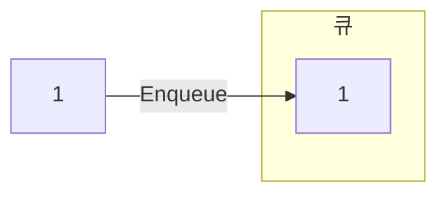
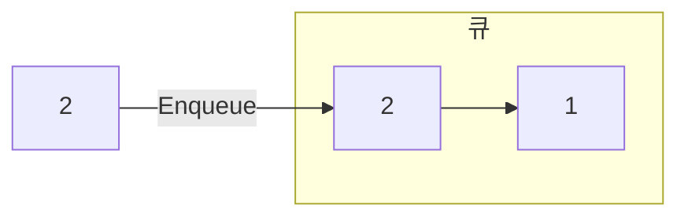
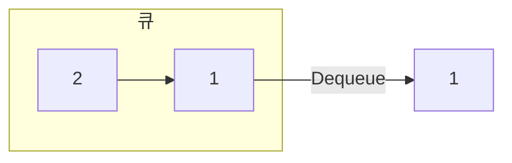
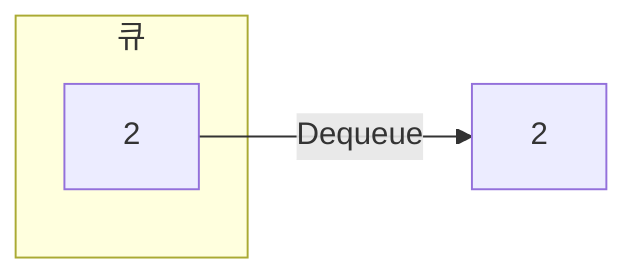

# 관련 문제

# 큐
먼저 들어간 데이터가 먼저 나오는 구조로 FIFO(first in first out)의 특징을 가지고 있음, 큐에 데이터를 삽입하는 연산은 Enqueue(Add) 꺼내는 연산은 Dequeue(Poll)

<br>
<br>

## 동작 원리
1. 빈 큐에 1, 2 순서로 삽입




2. Dequeue를 하면 2, 1 순서로 꺼내짐




<br>
<br>

## 활용
선입선출 방식의 큐는 많이 활용 됨
- 작업 대기열: 서버 요청 순차 처리
- 이벤트 처리: 애플리케이션 및 사용자 이벤트

<br>
<br>

## ADT

| 연산(메서드)        | 반환 타입  | 설명                                      |
|-------------------|---------|-----------------------------------------|
| `isFull()`        | `bool`  | 큐가 가득 찼는지 확인 (배열 기반에서 사용)   |
| `isEmpty()`       | `bool`  | 큐가 비어 있는지 확인                       |
| `add(item)`       | `void`  | 큐의 뒤(rear)에 `item` 추가                 |
| `poll()`          | `T`     | 큐의 앞(front) 요소 제거 후 반환              |
| `front()`         | `T`     | 큐의 앞(front) 요소 반환 (제거 안 함)         |
| `rear()`          | `T`     | 큐의 뒤(rear) 요소 반환 (제거 안 함)          |
| `data[maxsize]`   | `T[]`   | 최대 크기가 `maxsize`인 큐의 내부 데이터 배열 (배열 기반 큐에서 사용) |

<br>
<br>

### 세부 동작
### add(1) (enqueue)
1. `add(1)` 호출
2. `isFull()`을 호출하여 큐가 가득 찼는지 확인
3. 큐가 가득 차지 않았다면, rear 위치에 데이터 1 저장
4. rear을 1 증가

### poll() (dequeue)
1. `poll()` 호출
2. `isEmpty()`를 호출하여 큐가 비어있는지 확인
3. 큐가 비어있지 않다면, front 1 증가
5. 저장된 데이터 1 반환

> 큐가 관리하는 데이터는 front의 다음부터 rear까지

<br>
<br>

## Queue 인터페이스
코딩테스트에서는 보통 ArrayDeque를 더 많이 사용

```java
Queue<Integer> queue = new ArrayDeque<>();

// enqueue
queue.add(1);
queue.add(2);

// dequeue
int first = queue.poll();
System.out.println(first); // 1

queue.add(3);

first = queue.poll();
System.out.println(first); // 2
```

## 덱으로 스택, 큐 구현
> 덱(Deque, Double-Ended Queue): 양쪽 끝에서 데이터를 삽입하거나 삭제할 수 있는 자료 구조

```java
// 큐
ArrayDeque<Integer> queue = new ArrayDeque<>();

// enqueue
queue.addLast(1);
queue.addLast(2); // [1, 2]

// dequeue
int first = queue.pollFirst();
System.out.println(first); // 1

// 스택
ArrayDeque<Integer> stack = new ArrayDeque<>();

// push
stack addFirst(1);
stack addFirst(2); // [2, 1]

// pop
int first = queue.pollFirst();
System.out.println(first); // 2
```


