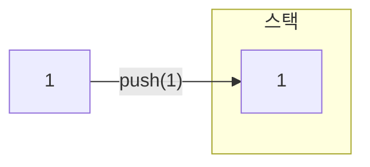
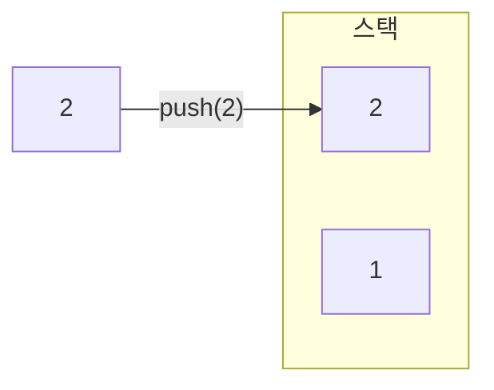
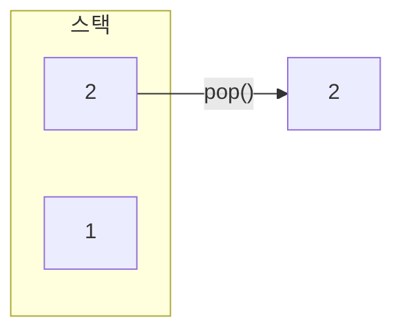
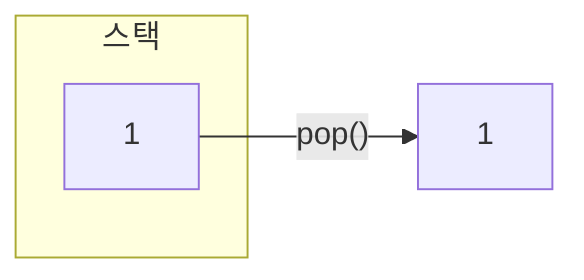

# 관련 문제
- [단어순서 뒤집기](https://github.com/han-chunsik/Algorithm/tree/b77a69ccb4a710ae3cd90a12123be2c5a338fd4f/%EB%B0%B1%EC%A4%80/Bronze/12605.%E2%80%85%EB%8B%A8%EC%96%B4%EC%88%9C%EC%84%9C%E2%80%85%EB%92%A4%EC%A7%91%EA%B8%B0)

# 스택
먼저 삽입한 데이터를 가장 나중에 꺼낼 수 있는 자료구조로 FILO(First In Last Out)구조를 가지고 있음, 스택에 데이터를 삽입하는 연산은 푸시(Push) 꺼내는 연산은 팝(Pop)

<br>
<br>

## 동작 원리
1. 빈 스택에 데이터 1 푸시


2. 데이터 2 푸시, 이전에 푸시한 1 위에 2가 올라감


3. 팝을 하면 가장 위에 있는 데이터 2를 꺼냄


4. 데이터 3 푸시, 1위에 3이 올라감


5. 팝을 2번 수행하면 3 -> 1 순서로 데이터를 꺼냄




<br>
<br>

## ADT

> ADT(Abstract Data Type, 추상 자료형): 데이터의 동작(연산)을 정의하는 개념

| 연산(메서드)   | 반환 타입  | 설명                          |
|--------------|---------|-----------------------------|
| `isFull()`   | `bool`  | 스택이 가득 찼는지 확인 (배열 기반에서 사용) |
| `isEmpty()`  | `bool`  | 스택이 비어 있는지 확인         |
| `push(item)` | `void`  | 스택의 맨 위에 `item` 추가     |
| `pop()`      | `T`     | 스택의 맨 위 요소 제거 후 반환  |
| `top()` 또는 `peek()` | `T` | 스택의 맨 위 요소 반환 (제거 안 함) |

<br>
<br>

### 세부 동작
### push()
1. `push(3)` 호출
2. `isFull()`를 호출하여 스택에 데이터가 가득 찼는지 확인
3. 스택이 가득차지 않았다면, top을 1만큼 증가
4. 증가된 top 위치에 데이터 3 추가

### pop()
1. `pop()` 호출
2. `isEmpty()`를 호출하여 스택에 데이터가 비어있는지 확인
3. 스택이 비어있지 않다면, top을 1만큼 감소
4. 데이터 3 반환

<br>
<br>

## Stack 클래스
최근에 삽입한 데이터로 연산을 해야한다면 스택 사용

```java
// 객체 생성
Stack<Integer> stack = new Stack<>();

// push
stack.push(1);
stack.push(3);

System.out.println(stack.isEmpty()); // 비어있지 않으므로 false

System.out.println(stack.peek()); // 가장 최근에 푸시한 값
System.out.println(stack.size()); // 2

// pop
System.out.println(stack.pop()); // 3
System.out.println(stack.pop()); // 1
System.out.println(stack.isEmpty()); // 비어있으므로 true
```


